# Auto Load Balancer + Auto Scaling Group Demo (AWS)

This project demonstrates a complete AWS architecture using an **Application Load Balancer (ALB)** and an **Auto Scaling Group (ASG)** with **CPU-based scaling**, **CloudWatch monitoring**, and **AWS Systems Manager (SSM)** for secure instance access.

The goal of this demo is to show how AWS automatically scales EC2 instances in response to load while maintaining application availability.

---

## Architecture Overview

- Application Load Balancer (ALB)
- Auto Scaling Group (min: 2, max: 4)
- Launch Template with user data
- EC2 instances (Amazon Linux 2023)
- Target Group with health checks
- CloudWatch CPUUtilization metrics
- Target tracking scaling policy (50% CPU)
- AWS Systems Manager (Session Manager)
- Stress testing using `stress-ng`

---

## Screenshots Walkthrough

### 1. Application Load Balancer – Details
Shows the ALB configuration and DNS endpoint.
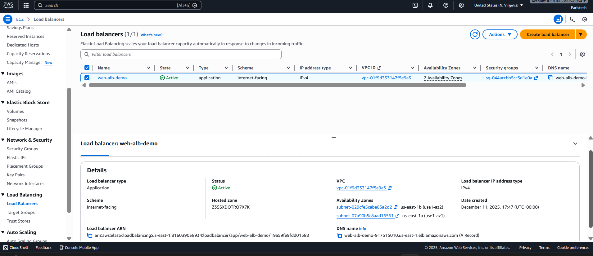

---

### 2. Load Balancer DNS – Browser Tests
The same DNS endpoint showing traffic routed to different instances.
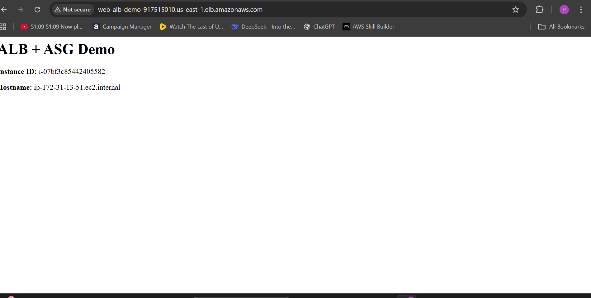

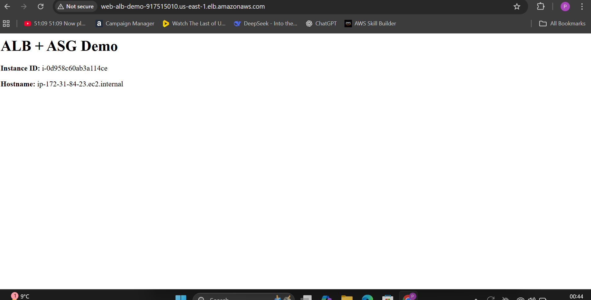

---

### 3. Target Group – Healthy Instances
Confirms that instances are passing health checks.

---

### 4. Launch Template – User Data
Startup script used to configure EC2 instances at launch.
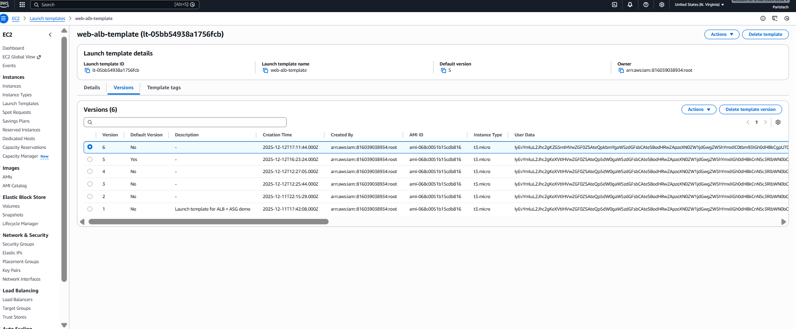

---

### 5. Auto Scaling Group – Configuration
Shows desired capacity and scaling limits.
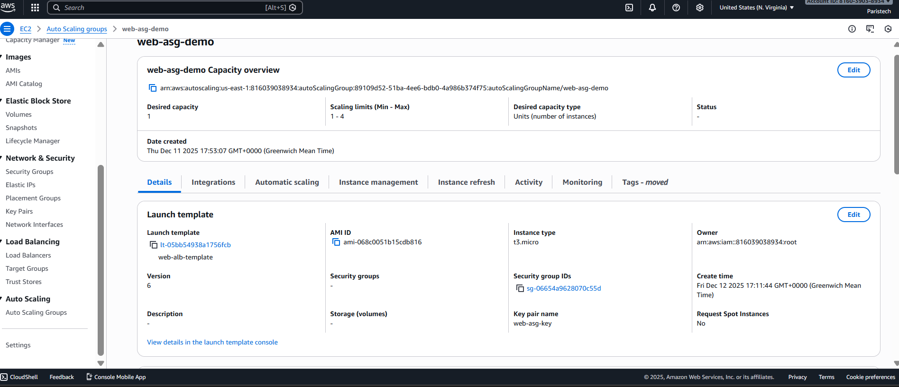

---

### 6. Auto Scaling Group – Instances
Instances currently managed by the ASG.
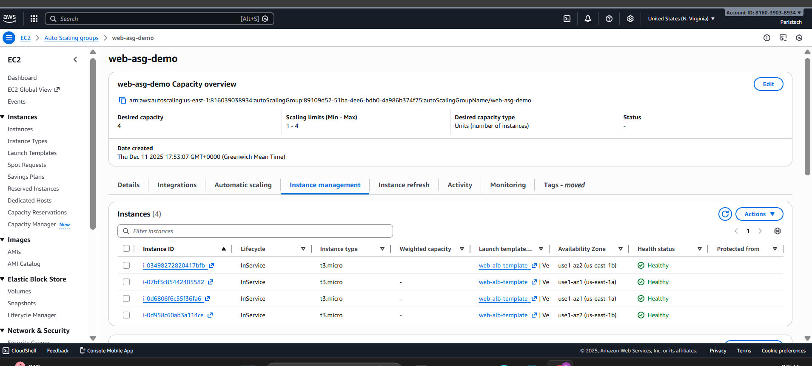

---

### 7. Auto Scaling Policy
Target tracking policy based on average CPU utilization.
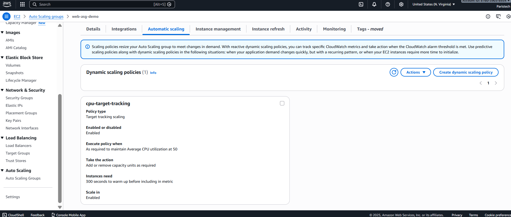

---

### 8. Auto Scaling Activity
Log showing scale-out events triggered by CPU load.
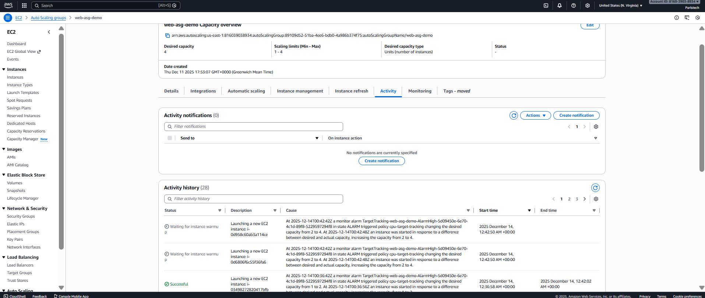

---

### 9. EC2 Instances – Running
All instances launched by the ASG and passing health checks.
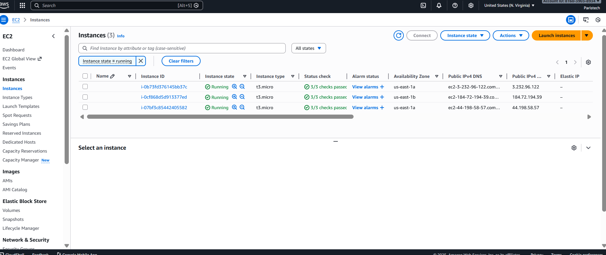

---

### 10. CloudWatch – CPU Spike
CPU utilization exceeding the 50% target during stress testing.
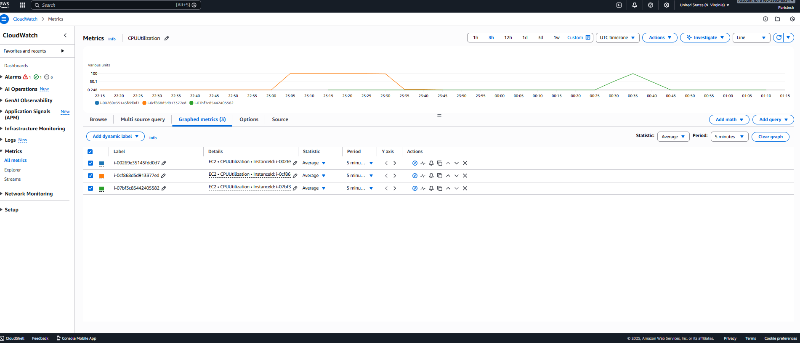

---

### 11. Systems Manager – Managed Instance
Instance registered and accessible via SSM (no SSH required).
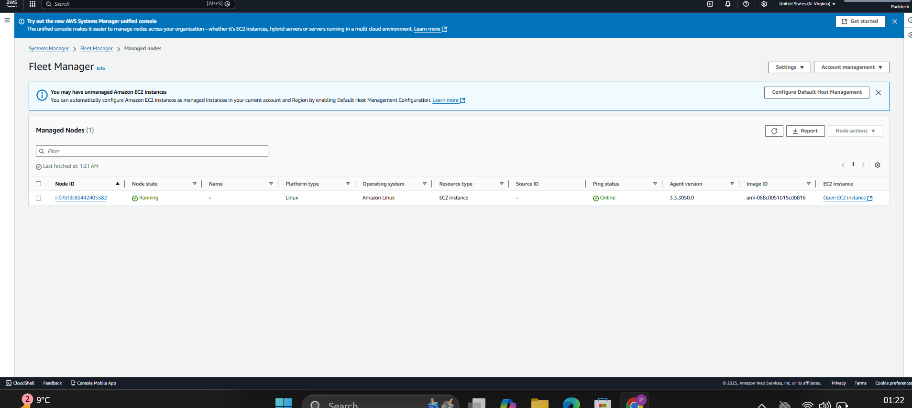

---

### 12. Stress Test via SSM
CPU stress test executed using `stress-ng`.
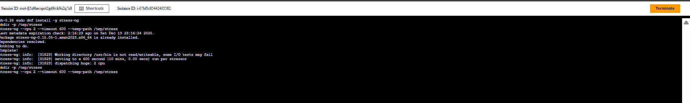

---

### 13. Final System State
System stabilizes after scaling event completes.

---

## Key Learnings

- Auto Scaling reacts to **real CloudWatch metrics**
- Target tracking simplifies scaling configuration
- ALB evenly distributes traffic across instances
- SSM is the cleanest and most secure way to manage ASG instances
- Scaling events are fully observable via CloudWatch and ASG activity logs

---

## Tools & Services Used

- Amazon EC2
- Application Load Balancer
- Auto Scaling Groups
- CloudWatch
- AWS Systems Manager
- Amazon Linux 2023
- stress-ng

---

## Author

Built and tested by **ph-cloudaws**  
Hands-on AWS infrastructure demo from start to finish.
